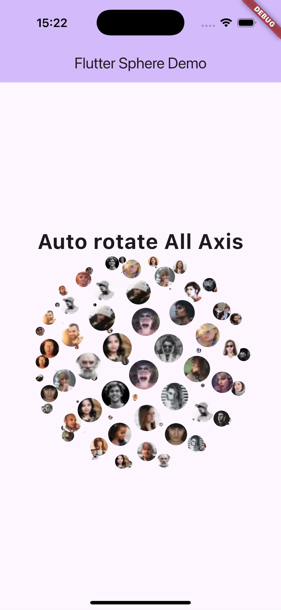
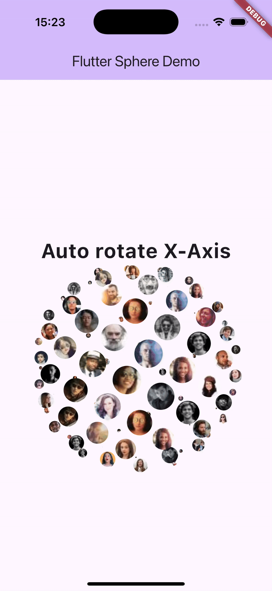
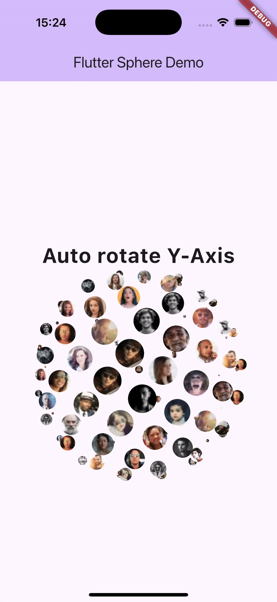
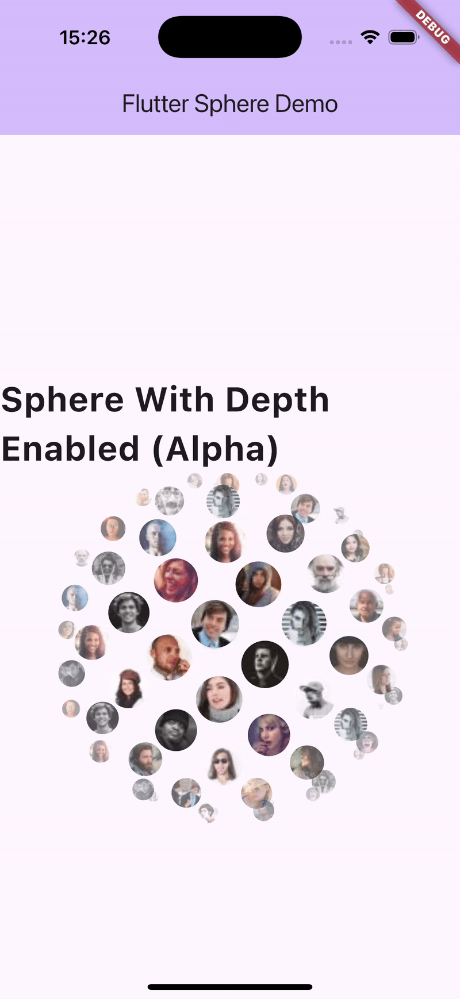
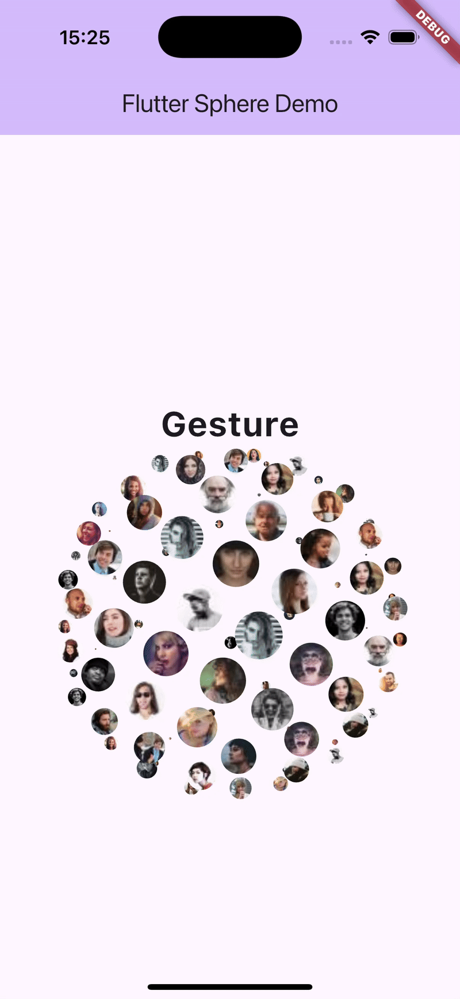

# Sphere — 3D Rotating Globe Widget for Flutter

Sphere is a highly customizable 3D globe widget written using a **custom RenderObject**.  
It positions child widgets on a virtual sphere using Fibonacci distribution and renders them with depth-based scaling, alpha, and hit-testing.

This widget works on all Flutter platforms, including **web**, **mobile**, and **desktop**.

---

## 🌀 Features

- 🌐 3D spherical layout using Fibonacci sphere algorithm
- 🎛️ External control for **horizontal** and **vertical** rotations
- 🖱️ Optional gesture-based interactive rotation
- 🔍 Depth-based scaling & alpha for realistic 3D effect
- 🖼️ Supports any Flutter widget as a sphere point (avatars, icons, etc.)
- ⚡ Efficient RenderObject implementation
- 🖱️ Fully functional hit testing (children are clickable)
- 🧱 No dependencies — pure Flutter

---

## Sample Images


 




## 📦 Installation

Add the package to your **pubspec.yaml**:

```yaml
dependencies:
  sphere: ^latest_version
```

Import:
```dart 
import 'package:sphere/sphere.dart';
```

## Sample Usages

### ⭐ Auto Rotate (All Axis)
```dart 
Sphere.rotate(
  size: 300,
  alphaEnabled: false,
  children: List.generate(
    100,
    (i) => ClipOval(
      child: Image.network('https://i.pravatar.cc/30?u=$i'),
    ),
  ),
)
```
### ⭐ Auto Rotate X-Axis Only
```dart 
Sphere.rotate(
  size: 300,
  alphaEnabled: false,
  isRotationX: true,
  isRotationY: false,
  children: List.generate(
    100,
    (i) => ClipOval(
      child: Image.network('https://i.pravatar.cc/30?u=$i'),
    ),
  ),
)
```
### ⭐ Auto Rotate Y-Axis Only
```dart 
Sphere.rotate(
  size: 300,
  alphaEnabled: false,
  isRotationX: false,
  isRotationY: true,
  children: List.generate(
    100,
    (i) => ClipOval(
      child: Image.network('https://i.pravatar.cc/30?u=$i'),
    ),
  ),
),
```
### ⭐Gesture-Controlled Rotation
```dart
Sphere.gesture(
  size: 300,
  alphaEnabled: false,
  children: List.generate(
    100,
    (i) => ClipOval(
      child: Image.network('https://i.pravatar.cc/30?u=$i'),
    ),
  )
),
```
### ⭐Gesture Mode with Alpha (Depth Fade Enabled)
```dart
Sphere.gesture(
  size: 300,
  alphaEnabled: true,
  children: List.generate(
    100,
    (i) => ClipOval(
      child: Image.network('https://i.pravatar.cc/30?u=$i'),
    ),
  ),
)
```
# ❤️ Contributing

Feel free to open issues or submit PRs.
Feedback and feature requests are welcome!

